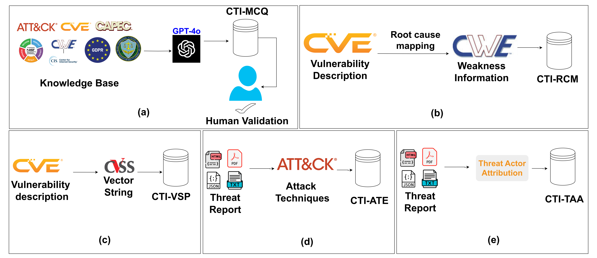

# CTIBench

CTIBench is a benchmark for evaluating large language models on practical
Cyber Threat Intelligence (CTI) tasks. It covers CTI knowledge, vulnerability
root-cause mapping, vulnerability severity prediction, ATT&CK technique
extraction, and threat actor attribution.

<p align="center">
  <a href="https://maveryn.github.io/cti-bench/"></a>
  <a href="https://arxiv.org/abs/2406.07599"></a>
  <a href="docs/assets/pdfs/ctibench.pdf"></a>
  <a href="https://huggingface.co/datasets/AI4Sec/cti-bench"></a>
  
</p>

<p align="center">
  
</p>

## Highlights

- First broad CTI benchmark for evaluating LLMs across practical intelligence tasks
- 5 task families covering CTI knowledge, CVE/CWE reasoning, CVSS scoring, ATT&CK technique extraction, and threat attribution
- 4,610 released benchmark examples plus a 2021 root-cause mapping comparison split
- Evaluations for ChatGPT-3.5, ChatGPT-4, Gemini-1.5, LLAMA3-70B, and LLAMA3-8B
- Released datasets, formatted model responses, raw logs, evaluation notebooks, and project page

## Resources

| Resource | Link |
| --- | --- |
| Project page | https://maveryn.github.io/cti-bench/ |
| Paper | https://arxiv.org/abs/2406.07599 |
| Dataset | https://huggingface.co/datasets/AI4Sec/cti-bench |

## Repository Layout

| Path | Description |
| --- | --- |
| `data/` | CTIBench task TSV files |
| `evaluation/` | Evaluation and model-prediction notebooks |
| `evaluation/responses/` | Formatted model responses used by the evaluation notebook |
| `logs/` | Raw model outputs for ChatGPT-3.5, ChatGPT-4, and Gemini-1.5 |
| `docs/` | Minimal static project page for GitHub Pages |

## Dataset Overview

| Task | File | Examples | Target |
| --- | --- | ---: | --- |
| CTI-MCQ | `data/cti-mcq.tsv` | 2,500 | Multiple-choice CTI knowledge answer |
| CTI-RCM | `data/cti-rcm.tsv` | 1,000 | CWE root-cause mapping |
| CTI-RCM-2021 | `data/cti-rcm-2021.tsv` | 1,000 | 2021 comparison split for CWE mapping |
| CTI-VSP | `data/cti-vsp.tsv` | 1,000 | CVSS v3.1 vector string |
| CTI-ATE | `data/cti-ate.tsv` | 60 | MITRE ATT&CK technique IDs |
| CTI-TAA | `data/cti-taa.tsv` | 50 | Threat actor attribution prompt inputs |

For CTI-TAA, `data/cti-taa.tsv` contains the URL, anonymized report text, and prompt.
The formatted response file `evaluation/responses/cti-taa-responses.tsv` includes the
ground-truth threat actor labels used by the evaluation notebook.

Dataset details are also available on Hugging Face:
https://huggingface.co/datasets/AI4Sec/cti-bench

## Evaluation

The `evaluation/` directory contains notebooks for generating predictions and
evaluating formatted responses. The response TSVs include predictions for:

- ChatGPT-3.5
- ChatGPT-4
- Gemini-1.5
- LLAMA3-70B
- LLAMA3-8B

The main evaluation metrics are accuracy for CTI-MCQ and CTI-RCM, mean absolute
deviation for CTI-VSP, F1 for CTI-ATE, and correct/plausible accuracy for CTI-TAA.

## Star History

[](https://www.star-history.com/#maveryn/cti-bench&type=date&legend=top-left)

## Citation

If you use CTIBench, please cite:

```bibtex
@article{alam2024ctibench,
  title={Ctibench: A benchmark for evaluating llms in cyber threat intelligence},
  author={Alam, Md Tanvirul and Bhusal, Dipkamal and Nguyen, Le and Rastogi, Nidhi},
  journal={Advances in Neural Information Processing Systems},
  volume={37},
  pages={50805--50825},
  year={2024}
}
```
